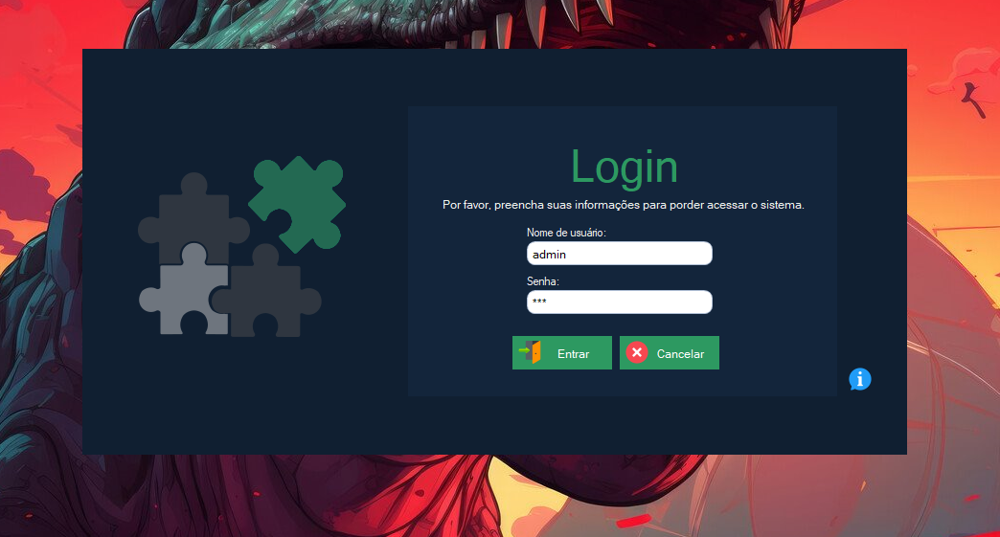
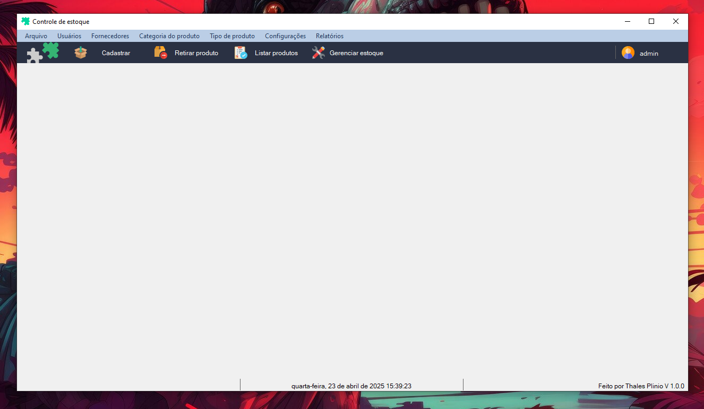
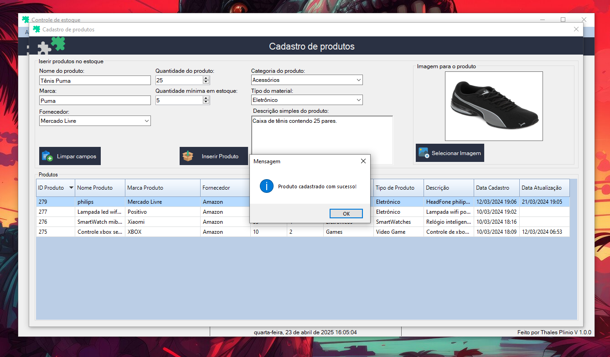

<h1 style="text-align:center;">Projeto controle e gestão de estoque com C# Windowns Forms</h1>

    

    

Status: Em desenvolvimento.

### 💻 Projeto .NET Framework C# Windows Forms para controle e gestão de estoque, com gestão de produtos e usuários.

#### Sobre o projeto

#### 📌 Este projeto foi feito para fins de estudos da linguagem C# no ambiente .NET utilizando Windows Forms Application para aplicações desktop com o banco de dados SQLite mas pode ser possivel alterar para bancos como SQLServer, PostgreSQL ou MySQL, conta com área de login para acessar a aplicação e controle de usuários, com níveis de acesso e status, na aplicação podem ser feitos cadastros de novos usuários e modificar suas configurações assim como cadastro de produtos, Fornecedores, Categorias e tipo de produto, possui área para buscas e consultas de produtos, retiradas e gerenciamento. Conta também com uma área para possíveis relatórios em PDF.

#### Tecnologias utilizadas

- .NET Framework 4.7
- C#
- Windows Forms
- SQLite

## 🚀 Iniciando o projeto

> baixe o projeto, no projeto contém o arquivo de solução (.sln), para poder acessar utilizando o Visual Studio Community ou a ide Rider

> mas caso queira baixar para testar dentro do diretório "WindowsFormsApp1/WindowsFormsApp1/bin/debug/WindowsFormApp1.exe" é onde está localizado o arquivo de execução do sistema, abra ele. Mas para isso é necessário ter o runtime .net instalado na sua máquina.

## Login

    

## Tela inicial do programa

    

## Tela de cadastro de produtos

    

### Autor: Thales Plinio
